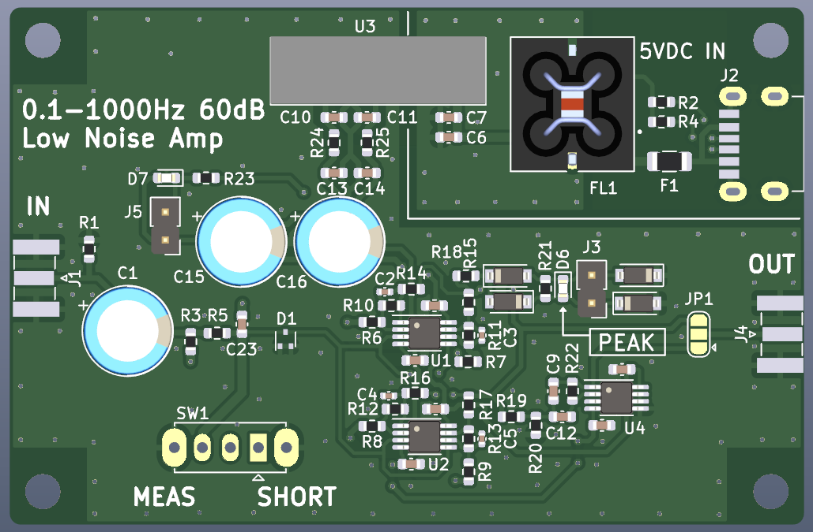
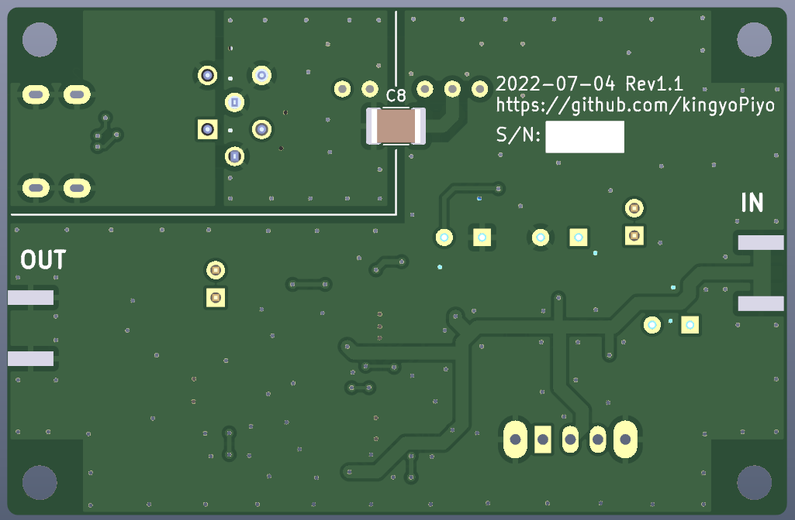

# AF-LNA
ADA4522-2ARMZ を 4パラで使用した低周波用のローノイズアンプです。  
帯域は0.1～1000Hz、ゲインは60dB、ノイズは5nV/√Hz以下となるように設計しています。  

## PCB Image  
  
  

## Schematic
[Schematic.pdf](doc/schematic.pdf "Schematic")

## 開発環境
- KiCad Version 6.0.5
