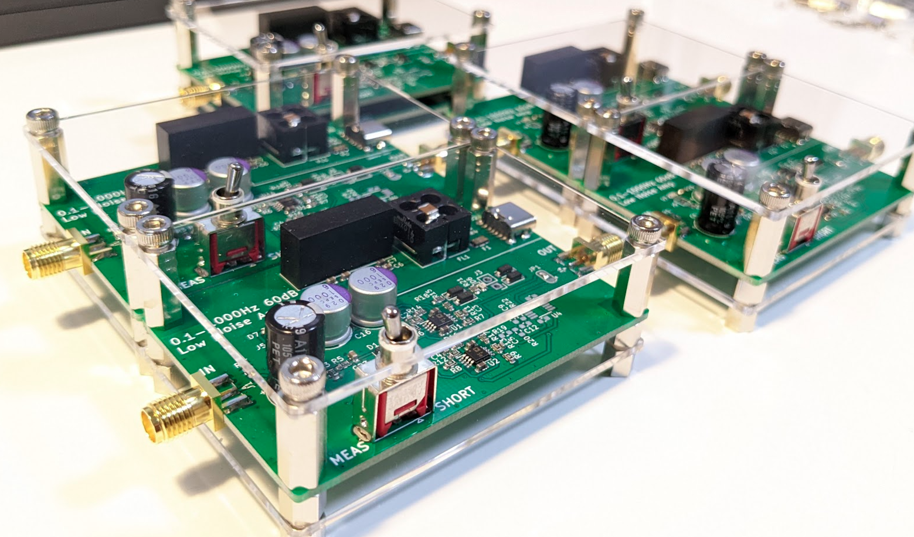

# AF-LNA
ADA4522-2ARMZ を 4パラで使用した低周波用のローノイズアンプです。  
帯域は 0.1～1000Hz、ゲインは 60dB、ノイズは 5nV/√Hz 以下となるように設計しています。  
⇒ 実測で 3.2nV/√Hz 程度となりました

  
  

## 主な仕様
| 項目 | 仕様 |
| ---- | ---- |
| 電源電圧 | 5V±0.5V（USB-C端子より供給） |
| 消費電流 | 50mA 以下 |
| 電圧利得 | 60dB（1000倍） |
| 電圧利得周波数特性 | 0.1～1000Hz（-3dB） |
| 入力換算雑音電圧密度 | 3.2nV/√Hz（typ） at 100Hz |
| 入力電圧範囲 | 入力保護クランプ ±0.5Vpp、DC 重畳は +30V 以下 |
| 入力結合 | AC結合（220uF、有極性コンデンサによる） |
| 入力インピーダンス | 10kΩ at 10～1000Hz |
| 出力インピーダンス | 120Ω at 10～1000Hz |
| 電源構成 | USB-C 側と回路の GND を絶縁型 DCDC により絶縁 （絶縁抵抗 100MΩ 以上 at DC500V） |
| 表示LED | 通電表示（D7：緑色）、出力クリッピング表示（D6：赤色） |

## PCB Image  
  
  

## Schematic
[Schematic.pdf](doc/schematic.pdf "Schematic")

## 開発環境
- KiCad Version 6.0.5
